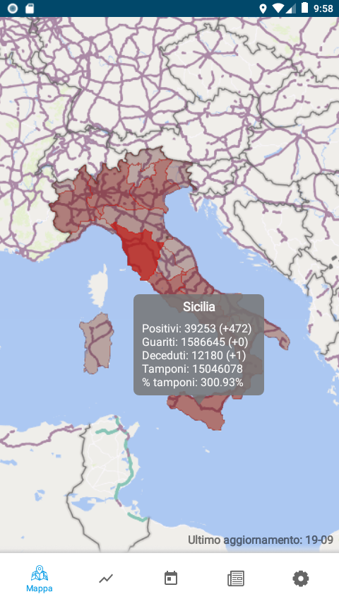
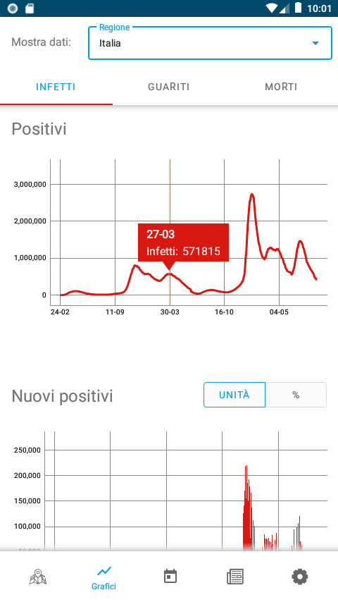
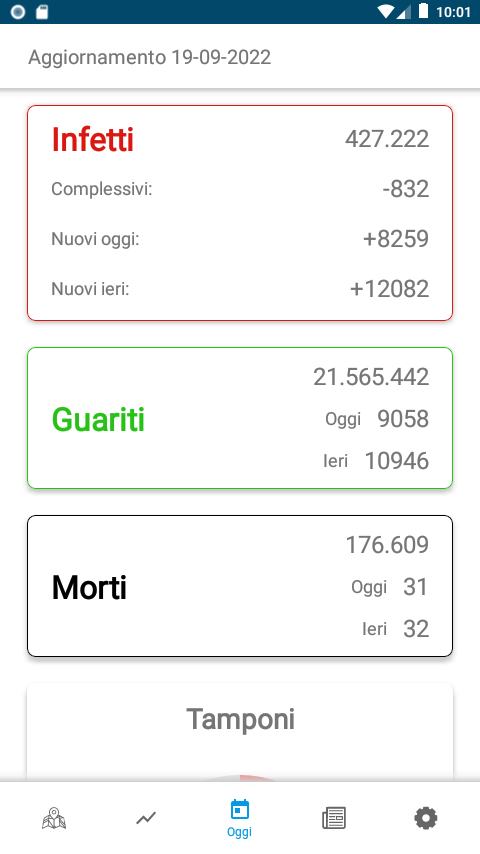

# COVID Italia

Android application to track the COVID-19 pandemic in Italy, using the official data provided by the [Italian Civil Protection Department](https://github.com/pcm-dpc/COVID-19).

The app is written in **Java**, using the **Android SDK**. It implements the **MVVM** architecture and common design patterns such as Singleton, Adapter, Observer, Factory, etc.

## Screenshots

    

        
        
Loading screen with prevention suggestion.

    

    

        
        
Interactive map with daily data of each region. The regions are colored depending on the number of positive cases.

    

    

        
        
Charts display the data of positive, healed and dead people during time.  The region of the data can be chosen.

    

    

        
        
Daily section shows the overral data change in the previous 24 hours.

    

    

        
        
News section with recent health news from the biggest newspapers in Italy.

    

